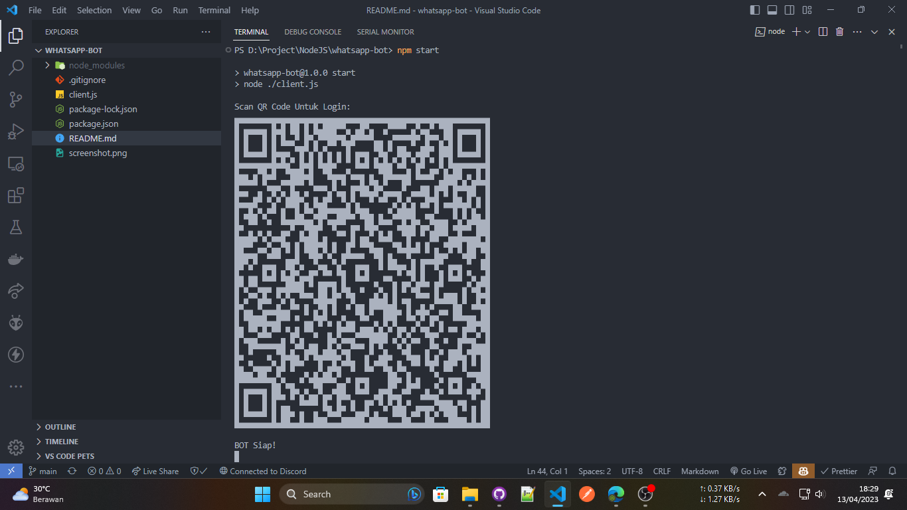

# CONTOH BOT WHATSAPP

Ketika di run maka akan disuruh scan QR Code untuk login WhatsApp


## Software

- [Node.js](https://nodejs.org/en)
- [Git](https://git-scm.com)

## Instalasi

### 1. Clone / Download Project

```
git clone https://github.com/baguspangestu/whatsapp-bot.git
```

### 2. Masuk ke Folder Project

```
cd whatsapp-bot
```

### 3. Install Package

```
npm install
```

### 4. jalankan

```
npm start
```

### 5. Tunggu beberapa detik, kemudian scan QR Code yang muncul di terminal

### 6. Coba kirim pesan "!ping" ke Bot WhatsApp

### 7. Baca dokumentasi lebih lanjut:

> [whatsapp-web.js](https://docs.wwebjs.dev)
